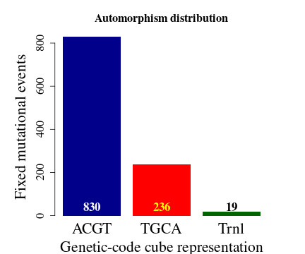
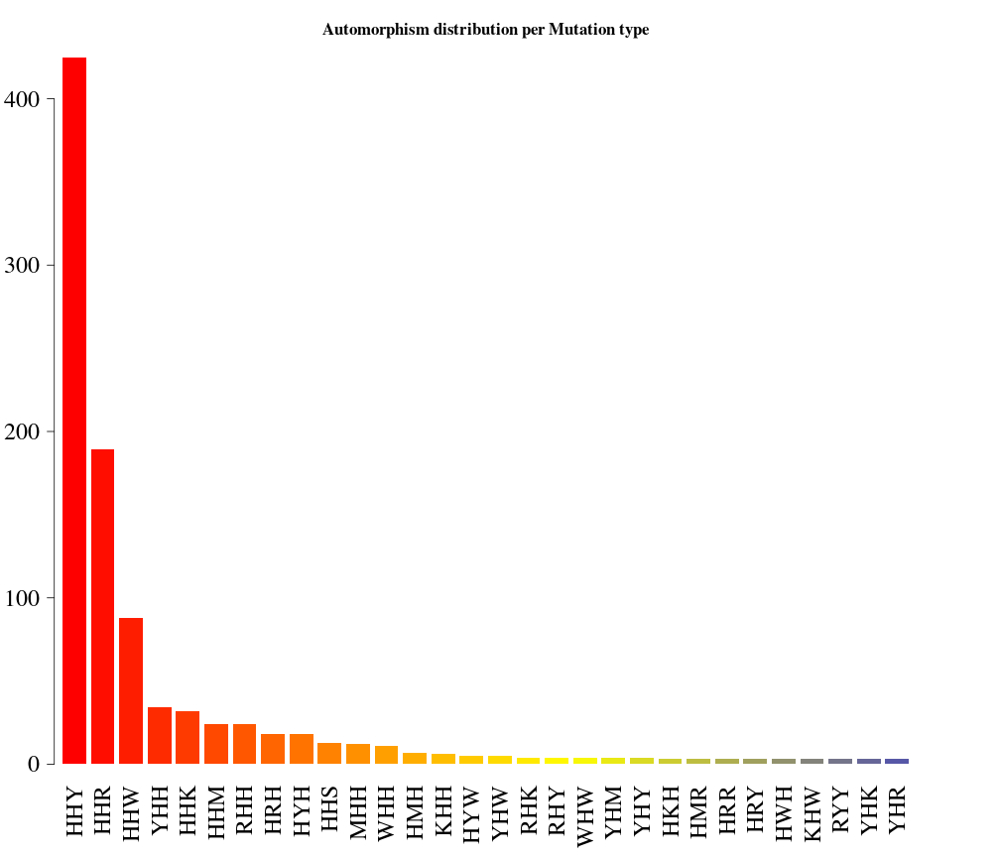
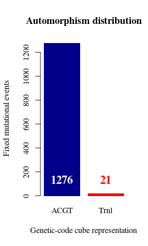
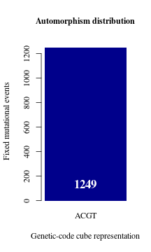

<style type="text/css">

.watch-out {
    max-width: 1820px !important;
    margin-left: auto;
    margin-right: auto;
    background-color: #c9feed;
    font-weight: bold
    font-size: 100%;
    padding: 2px;
}

pre, code {
    max-width: 1820px !important;
    margin-left: auto;
    margin-right: auto;
    background-color: #c9feed;
    font-weight: bold
    font-size: 100px;
    padding: 2px;
}

code {
    font-size: 100%;
    font-family: Consolas,Monaco,"Courier New",monospace;
    border-radius: 0;
}

code.r{
    font-size: 100%;
}
</style>

<script type="text/javascript">
document.addEventListener("DOMContentLoaded", function() {
  document.querySelector("h1").className = "title";
});
</script>
<script type="text/javascript">
document.addEventListener("DOMContentLoaded", function() {
  var links = document.links;  
  for (var i = 0, linksLength = links.length; i < linksLength; i++)
    if (links[i].hostname != window.location.hostname)
      links[i].target = '_blank';
});
</script>


# Overview
This is a R package to compute the autimorphisms between pairwise aligned DNA
sequences represented as elements from a Genomic Abelian group as described in
reference ([1](#1)). In a general scenario, whole chromosomes or genomic 
regions from a population (from any species or close related species) can be
algebraically represented as a direct sum of cyclic groups or more specifically
Abelian *p*-groups. Basically, we propose the representation of multiple
sequence alignments (MSA) of length _N_ as a finite Abelian group created by 
the direct sum of Abelian group of _prime-power order_:


$$
\qquad G = (\mathbb{Z}_{p^{\alpha_{1}}_1})^{n_1} \oplus 
(\mathbb{Z}_{p^{\alpha_{2}}_1})^{n_2} \oplus \dots \oplus 
(\mathbb{Z}_{p^{\alpha_{k}}_k})^{n_k} 
$$

Where, the $p_i$'s are prime numbers, $\alpha_i \in \mathbb{N}$ and 
$\mathbb{Z}_{p^{\alpha_{i}}_i}$ is the group of integer modulo 
$p^{\alpha_{i}}_i$. 

For the purpose of estimating the automorphism between two aligned DNA
sequences, $p^{\alpha_{i}}_i \in \{5, 2^6, 5^3 \}$.

## Automorphisms

Herein, automorphisms are considered algebraic descriptions of mutational event
observed in codon sequences represented on different Abelian groups. In
particular, as described in references ([3-4](#3)), for each representation of
the codon set on a defined Abelian group there are 24 possible isomorphic
Abelian groups. These Abelian groups can be labeled based on the DNA base-order
used to generate them. The set of 24 Abelian groups can be described as a group
isomorphic to the symmetric group of degree four ($S_4$, see reference
([4](#4))).

For further support about the symmetric group on the 24 Abelian group of 
genetic-code cubes, users can also see 
[Symmetric Group of the Genetic-CodeCubes.](https://is.gd/pTl8Js), 
specifically the Mathematica notebook 
_IntroductionToZ5GeneticCodeVectorSpace.nb_ and interact with it using
Wolfram Player, freely available (for Windows and Linux OS) at,
<https://www.wolfram.com/player/>.

## Load the R libraries


```r
library(Biostrings)
#> Loading required package: BiocGenerics
#> 
#> Attaching package: 'BiocGenerics'
#> The following objects are masked from 'package:stats':
#> 
#>     IQR, mad, sd, var, xtabs
#> The following objects are masked from 'package:base':
#> 
#>     Filter, Find, Map, Position, Reduce, anyDuplicated, append, as.data.frame, basename, cbind, colnames,
#>     dirname, do.call, duplicated, eval, evalq, get, grep, grepl, intersect, is.unsorted, lapply, mapply,
#>     match, mget, order, paste, pmax, pmax.int, pmin, pmin.int, rank, rbind, rownames, sapply, setdiff,
#>     sort, table, tapply, union, unique, unsplit, which.max, which.min
#> Loading required package: S4Vectors
#> Loading required package: stats4
#> 
#> Attaching package: 'S4Vectors'
#> The following objects are masked from 'package:base':
#> 
#>     I, expand.grid, unname
#> Loading required package: IRanges
#> Loading required package: XVector
#> Loading required package: GenomeInfoDb
#> 
#> Attaching package: 'Biostrings'
#> The following object is masked from 'package:base':
#> 
#>     strsplit
library(GenomAutomorphism)
```


# Read the alignment _FASTA_  and encode the sequences

A pairwise sequence alignment of protein coding regions SARS coronavirus GZ02
(GenBank: AY390556.1) and Bat SARS-like coronavirus isolate Rs7327 (GenBank:
KY417151.1) is provided with the package.

```r
data(covid_aln, package = "GenomAutomorphism")
covid_aln
#> DNAMultipleAlignment with 2 rows and 29166 columns
#>      aln                                                                                            names               
#> [1] ATGGAGAGCCTTGTTCTTGGTGTCAACGAGAAAACACACGTCCAAC...CAAAATTCCATGAGTGGAGCTTCTGCTGATTCAACTCAGGCATAA lcl|AY390556.1_cd...
#> [2] ATGGAGAGCCTTGTTCTTGGTGTCAACGAGAAAACACACGTCCAAC...CAAAATTCCATGAGTGGAGCTTCTGCTGATTCAACTCAGGCATAA lcl|KY417151.1_cd...
```

After the DNA sequence is read, the corresponding codon sequences can be
represented in the Abelian group $\mathbb{Z}_{64}$ (i.e., the set of integers
remainder modulo 64). The codon coordinates are requested on the cube ACGT.
Following reference ([4](#4))), cubes are labeled based on the order of DNA
bases used to define the sum operation.

```r
codons <- codon_coord(
                    codon = covid_aln, 
                    cube = "ACGT", 
                    group = "Z64", 
                    chr = 1L,
                    strand = "+",
                    start = 1,
                    end = 750)
codons
#> CodonGroup object with 250 ranges and 4 metadata columns:
#>         seqnames    ranges strand |        seq1        seq2      coord1      coord2
#>            <Rle> <IRanges>  <Rle> | <character> <character> <character> <character>
#>     [1]        1         1      + |         AAT         AAT           3           3
#>     [2]        1         2      + |         TGG         TGG          46          46
#>     [3]        1         3      + |         GGG         GGG          42          42
#>     [4]        1         4      + |         GTT         GTT          59          59
#>     [5]        1         5      + |         ACG         ACG          18          18
#>     ...      ...       ...    ... .         ...         ...         ...         ...
#>   [246]        1       246      + |         CGA         CGA          36          36
#>   [247]        1       247      + |         CGC         CGT          37          39
#>   [248]        1       248      + |         ACG         ACG          18          18
#>   [249]        1       249      + |         CAA         CAA           4           4
#>   [250]        1       250      + |         AGG         AGG          34          34
#>   -------
#>   seqinfo: 1 sequence from an unspecified genome; no seqlengths
```

The codon sequences (_seq1_ and _seq2_) with their corresponding coordinates
(left) are returned, as well as the coordinated representation on
$\mathbb{Z}_{64}$ (_coord1_ and _coord2_).

# Automorphisms on $\mathbb{Z}_{64}$

Automorphisms can be computed starting directly from the _FASTA_ file.
Notice that we can work only with genomic regions of our interest by giving 
the _start_ and _end_ alignment coordinates. In Z64 automorphisms are 
described as functions $f(x) = k\,x \quad mod\,64$, where $k$ and $x$ are
elements from the set of integers modulo 64. Below, in function
[automorphism](https://is.gd/WMxUKz) three important
arguments are given values: _group = "Z64"_, _cube = c("ACGT", "TGCA")_, and
_cube_alt = c("CATG", "GTAC")_. Setting for group specifies on which group the
automorphisms will be computed. These groups can be: "Z5", "Z64", "Z125", and
"Z5^3". 

In groups "Z64" and "Z125" not all the mutational events can be described as
automorphisms from a given cube. So, a character string denoting pairs of 
"dual" the genetic-code cubes, as given in references ([1-4](#2))), is given 
as argument for _cube_. That is, the base pairs from the given cubes must be
complementary each other. Such a cube pair are call dual cubes and, as shown 
in reference ([4](#4))), each pair integrates group. If automorphisms are not
found in first set of dual cubes, then the algorithm search for automorphism 
in a alternative set of dual cubes.


```r
autm <- automorphisms(
                    seqs = covid_aln,
                    group = "Z64",
                    cube = c("ACGT", "TGCA"),
                    cube_alt = c("CATG", "GTAC"),
                    start = 1,
                    end = 750, 
                    verbose = FALSE)
autm
#> Automorphism object with 250 ranges and 6 metadata columns:
#>         seqnames    ranges strand |        seq1        seq2    coord1    coord2      autm        cube
#>            <Rle> <IRanges>  <Rle> | <character> <character> <numeric> <numeric> <numeric> <character>
#>     [1]        1         1      + |         AAT         AAT         3         3         1        ACGT
#>     [2]        1         2      + |         TGG         TGG        46        46         1        ACGT
#>     [3]        1         3      + |         GGG         GGG        42        42         1        ACGT
#>     [4]        1         4      + |         GTT         GTT        59        59         1        ACGT
#>     [5]        1         5      + |         ACG         ACG        18        18         1        ACGT
#>     ...      ...       ...    ... .         ...         ...       ...       ...       ...         ...
#>   [246]        1       246      + |         CGA         CGA        36        36         1        ACGT
#>   [247]        1       247      + |         CGC         CGT        37        39        27        ACGT
#>   [248]        1       248      + |         ACG         ACG        18        18         1        ACGT
#>   [249]        1       249      + |         CAA         CAA         4         4         1        ACGT
#>   [250]        1       250      + |         AGG         AGG        34        34         1        ACGT
#>   -------
#>   seqinfo: 1 sequence from an unspecified genome; no seqlengths
```

Observe that two new columns were added, the automorphism coefficient $k$ 
(named as _autm_) and the genetic-code cube where the automorphism was found. 
By convention the DNA sequence is given for the positive strand. Since the 
_dual cube_ of **"ACGT"** corresponds to the complementary base order 
**TGCA**, automorphisms described by the cube **TGCA** represent mutational 
events affecting the DNA negative strand (-).


The last result can be summarized by gene regions as follow:

```r
aut_range <- automorphismByRanges(autm)
aut_range
#> GRanges object with 9 ranges and 1 metadata column:
#>       seqnames    ranges strand |        cube
#>          <Rle> <IRanges>  <Rle> | <character>
#>   [1]        1      1-43      + |        ACGT
#>   [2]        1        44      - |        TGCA
#>   [3]        1    45-105      + |        ACGT
#>   [4]        1       106      - |        TGCA
#>   [5]        1   107-117      + |        ACGT
#>   [6]        1       118      + |        Trnl
#>   [7]        1   119-211      + |        ACGT
#>   [8]        1       212      - |        TGCA
#>   [9]        1   213-250      + |        ACGT
#>   -------
#>   seqinfo: 1 sequence from an unspecified genome; no seqlengths
```


That is, function 
[automorphismByRanges](https://is.gd/5RWHFF) permits the classification
of the pairwise alignment of protein-coding sub-regions based on the
mutational events observed on it quantitatively represented as automorphisms 
on genetic-code cubes.

Searching for automorphisms on $\mathbb{Z}_{64}$ permits us a quantitative
differentiation between mutational events at different codon positions from a
given DNA protein-encoding region. As shown in reference ([4](#4)) a set of
different cubes can be applied to describe the best evolutionary aminoacid 
scale highly correlated with aminoacid physicochemical properties describing 
the observed evolutionary process in a given protein.

More information about this subject can be found in the supporting material 
from reference ([4](#4))) at GitHub
[GenomeAlgebra_SymmetricGroup](https://is.gd/pTl8Js),
particularly by interacting with the Mathematica notebook
[Genetic-Code-Scales_of_Amino-Acids.nb](https://is.gd/LVd06G).

# Automorphisms between whole genomes of SARS-CoV-2 related coronaviruses
Next, the automorphism for the whole pairwise alignment of SARS-CoV-2 related 
coronaviruses:

```r
## Do not need to run it. 
covid_autm <- automorphisms(
                    seq = covid_aln,
                    group = "Z64",
                    cube = c("ACGT", "TGCA"),
                    cube_alt = c("CATG", "GTAC"),
                    verbose = FALSE)
```

This data is available with the package

```r
data(covid_autm, package = "GenomAutomorphism")
covid_autm
#> Automorphism object with 9722 ranges and 6 metadata columns:
#>          seqnames    ranges strand |        seq1        seq2    coord1    coord2      autm        cube
#>             <Rle> <IRanges>  <Rle> | <character> <character> <numeric> <numeric> <numeric> <character>
#>      [1]        1         1      + |         ATG         ATG        50        50         1        ACGT
#>      [2]        1         2      + |         GAG         GAG        10        10         1        ACGT
#>      [3]        1         3      + |         AGC         AGC        33        33         1        ACGT
#>      [4]        1         4      + |         CTT         CTT        55        55         1        ACGT
#>      [5]        1         5      + |         GTT         GTT        59        59         1        ACGT
#>      ...      ...       ...    ... .         ...         ...       ...       ...       ...         ...
#>   [9718]        1      9718      + |         TCA         TCA        28        28         1        ACGT
#>   [9719]        1      9719      + |         ACT         ACT        19        19         1        ACGT
#>   [9720]        1      9720      + |         CAG         CAG         6         6         1        ACGT
#>   [9721]        1      9721      + |         GCA         GCA        24        24         1        ACGT
#>   [9722]        1      9722      + |         TAA         TAA        12        12         1        ACGT
#>   -------
#>   seqinfo: 1 sequence from an unspecified genome; no seqlengths
```

And the summary by range

```r
aut_range <- automorphismByRanges(covid_autm)
aut_range
#> GRanges object with 460 ranges and 1 metadata column:
#>         seqnames    ranges strand |        cube
#>            <Rle> <IRanges>  <Rle> | <character>
#>     [1]        1     1-102      + |        ACGT
#>     [2]        1       103      - |        TGCA
#>     [3]        1   104-105      + |        ACGT
#>     [4]        1       106      - |        TGCA
#>     [5]        1   107-201      + |        ACGT
#>     ...      ...       ...    ... .         ...
#>   [456]        1 9577-9608      + |        ACGT
#>   [457]        1      9609      - |        TGCA
#>   [458]        1 9610-9674      + |        ACGT
#>   [459]        1      9675      - |        TGCA
#>   [460]        1 9676-9722      + |        ACGT
#>   -------
#>   seqinfo: 1 sequence from an unspecified genome; no seqlengths
```

Regions no described by automorphism can be described as translations (labeled 
"Trnl") and they can be shown as follow:

```r
idx = which(covid_autm$cube == "Trnl")
covid_autm[ idx ]
#> Automorphism object with 19 ranges and 6 metadata columns:
#>        seqnames    ranges strand |        seq1        seq2    coord1    coord2      autm        cube
#>           <Rle> <IRanges>  <Rle> | <character> <character> <numeric> <numeric> <numeric> <character>
#>    [1]        1       916      + |         AAC         AAA         1         0         0        Trnl
#>    [2]        1       944      + |         ---         CCG        NA        22         0        Trnl
#>    [3]        1       971      + |         ACA         ---        16        NA         0        Trnl
#>    [4]        1      7077      + |         ---         AAA        NA         0         0        Trnl
#>    [5]        1      9109      + |         AAT         AAA         3         0         0        Trnl
#>    ...      ...       ...    ... .         ...         ...       ...       ...       ...         ...
#>   [15]        1      9277      + |         CTT         ---        55        NA         0        Trnl
#>   [16]        1      9278      + |         CAT         ---         7        NA         0        Trnl
#>   [17]        1      9279      + |         GAA         ---         8        NA         0        Trnl
#>   [18]        1      9295      + |         AAA         ---         0        NA         0        Trnl
#>   [19]        1      9296      + |         CGA         ---        36        NA         0        Trnl
#>   -------
#>   seqinfo: 1 sequence from an unspecified genome; no seqlengths
```

These codon positions cover insertion-deletion (_indel_) mutational events.
The wholes regions can be summarized typing:

```r
idx = which(aut_range$cube == "Trnl")
aut_range[ idx ]
#> GRanges object with 13 ranges and 1 metadata column:
#>        seqnames    ranges strand |        cube
#>           <Rle> <IRanges>  <Rle> | <character>
#>    [1]        1       916      + |        Trnl
#>    [2]        1       944      + |        Trnl
#>    [3]        1       971      + |        Trnl
#>    [4]        1      7077      + |        Trnl
#>    [5]        1      9109      + |        Trnl
#>    ...      ...       ...    ... .         ...
#>    [9]        1 9244-9245      + |        Trnl
#>   [10]        1      9247      + |        Trnl
#>   [11]        1      9257      + |        Trnl
#>   [12]        1 9277-9279      + |        Trnl
#>   [13]        1 9295-9296      + |        Trnl
#>   -------
#>   seqinfo: 1 sequence from an unspecified genome; no seqlengths
```

Only one indel mutation was found in the region where the spike glycoprotein is
located: 7076 - 8331.

That is, the pairwise alignment of SARS coronavirus GZ02 and Bat SARS-like
coronavirus (bat-SL-CoVZC45) reveals four single _indel_ mutational events and
four regions with multiple _indel_ mutations. In general, _indel_ mutational 
event can be modeled as translations on $\mathbb{Z}_{64}$. 

## Bar plot automorphism distribution by cubes
The automorphism distribution by cubes can be summarized in the bar-plot 
graphic


```r
counts <- table(covid_autm$cube[ covid_autm$autm != 1 | 
                                    is.na(covid_autm$autm) ])

par(family = "serif", cex = 0.9, font = 2, mar=c(4,6,4,4))
barplot(counts, main="Automorphism distribution",
        xlab="Genetic-code cube representation",
        ylab="Fixed mutational events",
        col=c("darkblue","red", "darkgreen"), 
        border = NA, axes = FALSE, 
        cex.lab = 2, cex.main = 1.5, cex.names = 2)
axis(2, at = c(0, 200, 400, 600, 800), cex.axis = 1.5)
mtext(side = 1,line = -1.5, at = c(0.7, 1.9, 3.1, 4.3, 5.5),
    text = paste0( counts ), cex = 1.4,
    col = c("white","yellow", "black"))
```




## Grouping automorphism by automorphism's coefficients. Types of mutations


```r
autby_coef <- automorphism_bycoef(covid_autm)
autby_coef <- autby_coef[ autby_coef$autm != 1 & autby_coef$autm != -1  ]
```

Barplot of  frequency of mutation types greater than 2.

```r
counts <- table(autby_coef$mut_type)
counts <- sort(counts, decreasing = TRUE)
count. <- counts[ counts > 2 ]

par(family = "serif", cex.axis = 2, font = 2, las = 1, 
    cex.main = 1.4, mar = c(6,2,4,4))
barplot(count., main="Automorphism distribution per Mutation type",
        col = colorRampPalette(c("red", "yellow", "blue"))(36), 
        border = NA, axes = FALSE,las=2)
axis(side = 2,  cex.axis = 2, line = -1.8 )
```




Every single base mutational event across the MSA was classified according 
IUPAC nomenclature: 1) According to the number of hydrogen bonds (on DNA/RNA
double helix): strong S={C, G} (three hydrogen bonds) and weak W={A, U} (two
hydrogen bonds). According to the chemical type: purines R={A, G} and
pyrimidines Y={C, U}. 3). According to the presence of amino or keto groups on
the base rings: amino M={C, A} and keto K={G, T}.  Constant (hold) base
positions were labeled with letter H. So, codon positions labeled as HKH means
that the first and third bases remains constant and mutational events between
bases G and T were found in the MSA.


```r
counts
#> 
#> HHY HHR HHW YHH HHK HHM RHH HRH HYH HHS MHH WHH HMH KHH HYW YHW RHK RHY WHW YHM YHY HKH HMR HRR HRY HWH KHW RYY YHK YHR 
#> 425 189  88  34  32  24  24  18  18  13  12  11   7   6   5   5   4   4   4   4   4   3   3   3   3   3   3   3   3   3 
#> HMW HYK KHY KSW MHK MHW MRH RHM RHR RHW RKW RMH RMW RRY RSW RYH RYW SHH SHW SRH WMH WMS WSY YWH HKR HMK HMY HSR HWS HWW 
#>   2   2   2   2   2   2   2   2   2   2   2   2   2   2   2   2   2   2   2   2   2   2   2   2   1   1   1   1   1   1 
#> HWY HYR HYY KHK KHR KKS KMH KMW KRK KRY KSH MHR MHS MKM MMM MRM MWH MWM MWS MWW MYY RMY RRK RRM RSK RYK SHM SHY SKY SMW 
#>   1   1   1   1   1   1   1   1   1   1   1   1   1   1   1   1   1   1   1   1   1   1   1   1   1   1   1   1   1   1 
#> SRM SWR SWY SYH WHY WRH WRY WWH WWK WWS WWY WYH WYM WYW YHS YKH YKY YRY YWM YWW YWY YYH YYR 
#>   1   1   1   1   1   1   1   1   1   1   1   1   1   1   1   1   1   1   1   1   1   1   1
```

The analysis of the frequency of mutational events (automorphisms, COVID: 
human vs bat 610 strains) by mutation types is shown in Fig 8a. Results are
consistent with the well-known observation highlighted by Crick: the 
highest mutational rate is found in the third base of the codon (HHY: 425, 
HHR: 189, HHW: 88), followed by YHH: 34 in the first base, and the lowest 
rate is found in the second one ([5](#5)).


## Conserved and non-conserved regions
### Conserved regions
Conserved and non-conserved gene regions can be easily observed in most of 
MSA editing bioinformatic tools. However, here were interesting into get the
regions coordinates for further downstream analysis.

Conserved regions from pairwise comparisons are obtain with function 
conserved_regions:

```r
conserv <- conserved_regions(covid_autm)
conserv
#> AutomorphismByCoef object with 6348 ranges and 5 metadata columns:
#>          seqnames    ranges strand |        seq1        seq2      autm    mut_type        cube
#>             <Rle> <IRanges>  <Rle> | <character> <character> <numeric> <character> <character>
#>      [1]        1      1-19      + |         ATG         ATG         1         HHH        ACGT
#>      [2]        1      1-19      + |         GAG         GAG         1         HHH        ACGT
#>      [3]        1      1-19      + |         AGC         AGC         1         HHH        ACGT
#>      [4]        1      1-19      + |         CTT         CTT         1         HHH        ACGT
#>      [5]        1      1-19      + |         GTT         GTT         1         HHH        ACGT
#>      ...      ...       ...    ... .         ...         ...       ...         ...         ...
#>   [6344]        1 9683-9722      + |         GGA         GGA         1         HHH        ACGT
#>   [6345]        1 9683-9722      + |         TCT         TCT         1         HHH        ACGT
#>   [6346]        1 9683-9722      + |         TCA         TCA         1         HHH        ACGT
#>   [6347]        1 9683-9722      + |         GCA         GCA         1         HHH        ACGT
#>   [6348]        1 9683-9722      + |         TAA         TAA         1         HHH        ACGT
#>   -------
#>   seqinfo: 1 sequence from an unspecified genome; no seqlengths
```


Several regions are similar for more than one comparison.

```r
conserv_unique <- conserved_regions(covid_autm, output = "unique")
conserv_unique
#> GRanges object with 744 ranges and 2 metadata columns:
#>         seqnames    ranges strand |      autm        cube
#>            <Rle> <IRanges>  <Rle> | <numeric> <character>
#>     [1]        1      1-19      + |         1        ACGT
#>     [2]        1     21-44      + |         1        ACGT
#>     [3]        1     47-52      + |         1        ACGT
#>     [4]        1     54-60      + |         1        ACGT
#>     [5]        1     62-80      + |         1        ACGT
#>     ...      ...       ...    ... .       ...         ...
#>   [740]        1 9610-9614      + |         1        ACGT
#>   [741]        1 9616-9648      + |         1        ACGT
#>   [742]        1 9650-9674      + |         1        ACGT
#>   [743]        1 9676-9681      + |         1        ACGT
#>   [744]        1 9683-9722      + |         1        ACGT
#>   -------
#>   seqinfo: 1 sequence from an unspecified genome; no seqlengths
```


# Automorphisms on $\mathbb{Z}_{125}$

Alternatively, we can use the algebraic representation on on 
$\mathbb{Z}_{125}$.


```r
covid_autm_2 <- automorphisms(
                    seq = covid_aln, 
                    group = "Z125", 
                    cube = c("ACGT", "TGCA"),
                    cube_alt = c("CATG", "GTAC"),
                    verbose = FALSE)
covid_autm_2
#> Automorphism object with 9722 ranges and 6 metadata columns:
#>          seqnames    ranges strand |        seq1        seq2    coord1    coord2      autm        cube
#>             <Rle> <IRanges>  <Rle> | <character> <character> <numeric> <numeric> <numeric> <character>
#>      [1]        1         1      + |         AGA         AGA        81        81         1        ACGT
#>      [2]        1         2      + |         TAT         TAT        49        49         1        ACGT
#>      [3]        1         3      + |         GGG         GGG        93        93         1        ACGT
#>      [4]        1         4      + |         GTT         GTT       119       119         1        ACGT
#>      [5]        1         5      + |         AGT         AGT        84        84         1        ACGT
#>      ...      ...       ...    ... .         ...         ...       ...       ...       ...         ...
#>   [9718]        1      9718      + |         CTC         CTC       112       112         1        ACGT
#>   [9719]        1      9719      + |         TGA         TGA        96        96         1        ACGT
#>   [9720]        1      9720      + |         GTT         GTT       119       119         1        ACGT
#>   [9721]        1      9721      + |         CTA         CTA       111       111         1        ACGT
#>   [9722]        1      9722      + |         AAA         AAA        31        31         1        ACGT
#>   -------
#>   seqinfo: 1 sequence from an unspecified genome; no seqlengths
```


And the summary by range

```r
aut_range_2 <- automorphismByRanges(covid_autm_2)
aut_range_2
#> GRanges object with 9 ranges and 1 metadata column:
#>       seqnames    ranges strand |        cube
#>          <Rle> <IRanges>  <Rle> | <character>
#>   [1]        1    1-1784      + |        ACGT
#>   [2]        1 1785-1787      + |        Trnl
#>   [3]        1 1788-8117      + |        ACGT
#>   [4]        1 8118-8123      + |        Trnl
#>   [5]        1 8124-8255      + |        ACGT
#>   [6]        1 8256-8261      + |        Trnl
#>   [7]        1 8262-8285      + |        ACGT
#>   [8]        1 8286-8291      + |        Trnl
#>   [9]        1 8292-9722      + |        ACGT
#>   -------
#>   seqinfo: 1 sequence from an unspecified genome; no seqlengths
```


The whole genome can be described by automorphisms on $\mathbb{Z}_{125}$.

```r
counts <- table(covid_autm_2$cube[ covid_autm_2$autm != 1 ])

par(family = "serif", cex = 1, font = 2)
barplot(counts, main="Automorphism distribution",
        xlab="Genetic-code cube representation",
        ylab="Fixed mutational events",
        col=c("darkblue","red"), 
        ylim = c(0, 1300),
        border = NA, axes = TRUE)
mtext(side = 1,line = -2, at = c(0.7, 1.9, 3.1),
    text = paste0( counts ), cex = 1.4,
    col = c("white","red"))
```



# Automorphisms on the Genetic-code Cube Representation

The Genetic-code Cube Representations on the Galois Field GF(5) were studied in
([4](#4)). Each codon is represented by each coordinate in the 3D space.

Automorphisms are represented by diagonal matrices, with elements $x$ in 
$x \in \mathbb{Z}_5$.


```r
covid_autm_3 <- automorphisms(
                    seq = covid_aln, 
                    group = "Z5^3", 
                    cube = c("ACGT", "TGCA"),
                    cube_alt = c("CATG", "GTAC"),
                    verbose = FALSE)
covid_autm_3
#> Automorphism object with 9722 ranges and 6 metadata columns:
#>          seqnames    ranges strand |        seq1        seq2   coord1   coord2        autm        cube
#>             <Rle> <IRanges>  <Rle> | <character> <character> <matrix> <matrix> <character> <character>
#>      [1]        1         1      + |         AGA         AGA    1:3:1    1:3:1       1,1,1        ACGT
#>      [2]        1         2      + |         TAT         TAT    4:1:4    4:1:4       1,1,1        ACGT
#>      [3]        1         3      + |         GGG         GGG    3:3:3    3:3:3       1,1,1        ACGT
#>      [4]        1         4      + |         GTT         GTT    3:4:4    3:4:4       1,1,1        ACGT
#>      [5]        1         5      + |         AGT         AGT    1:3:4    1:3:4       1,1,1        ACGT
#>      ...      ...       ...    ... .         ...         ...      ...      ...         ...         ...
#>   [9718]        1      9718      + |         CTC         CTC    2:4:2    2:4:2       1,1,1        ACGT
#>   [9719]        1      9719      + |         TGA         TGA    4:3:1    4:3:1       1,1,1        ACGT
#>   [9720]        1      9720      + |         GTT         GTT    3:4:4    3:4:4       1,1,1        ACGT
#>   [9721]        1      9721      + |         CTA         CTA    2:4:1    2:4:1       1,1,1        ACGT
#>   [9722]        1      9722      + |         AAA         AAA    1:1:1    1:1:1       1,1,1        ACGT
#>   -------
#>   seqinfo: 1 sequence from an unspecified genome; no seqlengths
```

## Grouping automorphism by automorphism's coefficients

Automorphisms that preserved codons (DNA base-triplets) are represented by the
identity matrix, i.e., the matrix with diagonal elements "1,1,1".

```r
autby_coef_3 <- automorphism_bycoef(covid_autm_3)
autby_coef_3 <- autby_coef_3[ autby_coef_3$autm != "1,1,1" ]
autby_coef_3
#> AutomorphismByCoef object with 1249 ranges and 5 metadata columns:
#>          seqnames    ranges strand |        seq1        seq2        autm    mut_type        cube
#>             <Rle> <IRanges>  <Rle> | <character> <character> <character> <character> <character>
#>      [1]        1        28      + |         GGG         GAG       1,2,1         HRH        ACGT
#>      [2]        1        46      + |         CAC         CGC       1,3,1         HRH        ACGT
#>      [3]        1        60      + |         CTC         TTC       2,1,1         YHH        ACGT
#>      [4]        1        77      + |         TAT         TAC       1,1,3         HHY        ACGT
#>      [5]        1        97      + |         GGT         GAT       1,2,1         HRH        ACGT
#>      ...      ...       ...    ... .         ...         ...         ...         ...         ...
#>   [1245]        1      9649      + |         ATC         ACC       1,3,1         HYH        ACGT
#>   [1246]        1      9663      + |         CAT         TAT       2,1,1         YHH        ACGT
#>   [1247]        1      9680      + |         TAA         TGA       1,3,1         HRH        ACGT
#>   [1248]        1      9688      + |         CGT         CAT       1,2,1         HRH        ACGT
#>   [1249]        1      9703      + |         ATC         ACC       1,3,1         HYH        ACGT
#>   -------
#>   seqinfo: 1 sequence from an unspecified genome; no seqlengths
```


Conserved regions from pairwise comparisons are obtain with function 
conserved_regions:

```r
conserv <- conserved_regions(covid_autm_3)
conserv
#> AutomorphismByCoef object with 6964 ranges and 5 metadata columns:
#>          seqnames    ranges strand |        seq1        seq2        autm    mut_type        cube
#>             <Rle> <IRanges>  <Rle> | <character> <character> <character> <character> <character>
#>      [1]        1      1-27      + |         AGA         AGA       1,1,1         HHH        ACGT
#>      [2]        1      1-27      + |         TAT         TAT       1,1,1         HHH        ACGT
#>      [3]        1      1-27      + |         GGG         GGG       1,1,1         HHH        ACGT
#>      [4]        1      1-27      + |         GTT         GTT       1,1,1         HHH        ACGT
#>      [5]        1      1-27      + |         AGT         AGT       1,1,1         HHH        ACGT
#>      ...      ...       ...    ... .         ...         ...         ...         ...         ...
#>   [6960]        1 9704-9722      + |         CTC         CTC       1,1,1         HHH        ACGT
#>   [6961]        1 9704-9722      + |         TGA         TGA       1,1,1         HHH        ACGT
#>   [6962]        1 9704-9722      + |         GTT         GTT       1,1,1         HHH        ACGT
#>   [6963]        1 9704-9722      + |         CTA         CTA       1,1,1         HHH        ACGT
#>   [6964]        1 9704-9722      + |         AAA         AAA       1,1,1         HHH        ACGT
#>   -------
#>   seqinfo: 1 sequence from an unspecified genome; no seqlengths
```

The whole genome mutational events represented as automorphisms on the 3D space 
$\mathbb{Z}_{5}^3$, specifically on the cube ACGT (see [4](#4)).

```r
counts <- table(autby_coef_3$cube[ autby_coef_3$autm != "1,1,1"])

par(family = "serif", cex = 1, font = 2, cex.main = 1)
barplot(counts, main="Automorphism distribution",
        xlab="Genetic-code cube representation",
        ylab="Fixed mutational events",
        col=c("darkblue","red"), 
        ylim = c(0, 1300), 
        border = NA, axes = TRUE)
mtext(side = 1,line = -2, at = c(0.7, 1.9),
    text = paste0( counts ), cex = 1.4,
    col = c("white"))
```




# References
    1.<a name="1"></a> Sanchez R, Morgado E, Grau R. Gene algebra from a 
    genetic code algebraic structure. J Math Biol. 2005 Oct;51(4):431-57. 
    doi:10.1007/s00285-005-0332-8. Epub 2005 Jul 13. PMID: 16012800.
    ([PDF](https://arxiv.org/pdf/q-bio/0412033.pdf)).

    2.<a name="2"></a> Robersy Sanchez, Jesus Barreto (2021) Genomic Abelian
    Finite Groups. 
    [doi:10.1101/2021.06.01.446543](https://doi.org/10.1101/2021.06.01.446543)

    3.<a name="3"></a> M. V Jose, E.R. Morgado, R. Sanchez, T. Govezensky, The
    24 possible algebraic representations of the standard genetic code in six
    or in three dimensions, Adv. Stud. Biol. 4 (2012) 119-152.
    [PDF](https://is.gd/na9eap).

    4.<a name="4"></a> R. Sanchez. Symmetric Group of the Genetic-Code Cubes.
    Effect of the Genetic-Code Architecture on the Evolutionary Process MATCH
    Commun. Math. Comput. Chem. 79 (2018) 527-560. 
    [PDF](https://bit.ly/2Z9mjM7).
    
    5.<a name="5"></a>  Crick FHC. The Origin of the Genetic Code. J Mol Biol.
    1968;38: 367–379.

# Session info {.unnumbered}

Here is the output of `sessionInfo()` on the system on which this document was
compiled:


```
#> R version 4.2.0 (2022-04-22)
#> Platform: x86_64-pc-linux-gnu (64-bit)
#> Running under: Ubuntu 20.04.4 LTS
#> 
#> Matrix products: default
#> BLAS:   /usr/lib/x86_64-linux-gnu/blas/libblas.so.3.9.0
#> LAPACK: /usr/lib/x86_64-linux-gnu/lapack/liblapack.so.3.9.0
#> 
#> locale:
#>  [1] LC_CTYPE=en_US.UTF-8       LC_NUMERIC=C               LC_TIME=en_US.UTF-8        LC_COLLATE=C              
#>  [5] LC_MONETARY=en_US.UTF-8    LC_MESSAGES=en_US.UTF-8    LC_PAPER=en_US.UTF-8       LC_NAME=C                 
#>  [9] LC_ADDRESS=C               LC_TELEPHONE=C             LC_MEASUREMENT=en_US.UTF-8 LC_IDENTIFICATION=C       
#> 
#> attached base packages:
#> [1] stats4    stats     graphics  grDevices utils     datasets  methods   base     
#> 
#> other attached packages:
#> [1] Biostrings_2.64.0        GenomeInfoDb_1.32.1      XVector_0.36.0           IRanges_2.30.0          
#> [5] S4Vectors_0.34.0         BiocGenerics_0.42.0      BiocStyle_2.24.0         GenomAutomorphism_0.99.0
#> 
#> loaded via a namespace (and not attached):
#>  [1] prettyunits_1.1.1      ps_1.7.0               digest_0.6.29          assertthat_0.2.1       rprojroot_2.0.3       
#>  [6] foreach_1.5.2          utf8_1.2.2             R6_2.5.1               evaluate_0.15          highr_0.9             
#> [11] pillar_1.7.0           zlibbioc_1.42.0        rlang_1.0.2            rstudioapi_0.13        data.table_1.14.2     
#> [16] callr_3.7.0            rmarkdown_2.14         desc_1.4.1             devtools_2.4.3         BiocParallel_1.30.0   
#> [21] stringr_1.4.0          numbers_0.8-2          RCurl_1.98-1.6         compiler_4.2.0         xfun_0.30             
#> [26] pkgconfig_2.0.3        pkgbuild_1.3.1         htmltools_0.5.2        tidyselect_1.1.2       tibble_3.1.6          
#> [31] GenomeInfoDbData_1.2.8 roxygen2_7.1.2         codetools_0.2-18       fansi_1.0.3            crayon_1.5.1          
#> [36] dplyr_1.0.9            withr_2.5.0            commonmark_1.8.0       bitops_1.0-7           brio_1.1.3            
#> [41] lifecycle_1.0.1        DBI_1.1.2              magrittr_2.0.3         cli_3.3.0              stringi_1.7.6         
#> [46] cachem_1.0.6           fs_1.5.2               remotes_2.4.2          doParallel_1.0.17      testthat_3.1.4        
#> [51] xml2_1.3.3             ellipsis_0.3.2         generics_0.1.2         vctrs_0.4.1            iterators_1.0.14      
#> [56] tools_4.2.0            glue_1.6.2             purrr_0.3.4            yaml_2.3.5             processx_3.5.3        
#> [61] pkgload_1.2.4          parallel_4.2.0         fastmap_1.1.0          BiocManager_1.30.17    GenomicRanges_1.48.0  
#> [66] sessioninfo_1.2.2      memoise_2.0.1          knitr_1.39             usethis_2.1.5
```
